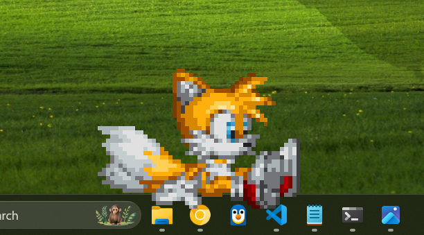

 # tails 

tails is a cute little assistant which you can play around with and get help from!  
built in python with love :3  

  

### how to run  
you can find executables for windows in releases tab!!  (linux isn't currently supported as tails uses OS-specific libs, currently working on support for linux)
  
OR, if you're running source code,  
you'll need to install, PyQt5 (graphics :3) and pynput (listening to mouse :3):  
`pip install PyQt5 pynput`  
and then run `main.py`!  
    
### how to interact  
**playing**:  
tails has a builtin routine system, so it'll automatically keep him active,  
every 2-5 seconds, he has a 20% chance, he'll walk around the taskbar,  
you can:  
- **right-click** ON him to get him to sit, stand, fly or talk
- **right-click** somewhere on the screen, he'll either fly or walk there

**chatting**:  
tails now has chatting support! he uses gemini 2.5 flash as his llm.  
you can right-click tails and click "Talk", it'll prompt you for an gemini API key, [get a free gemini api key](https://aistudio.google.com/apikey)  
after that, you'll need to open the console (the black window that's open), that's where tails talks to you, (i'll change that soon),  
you can talk through the beige window, and tails will reply right back in the black window.  (type exit or quit to exit the chat)

tails can:  
- implement the code it generates in your existing code inside your file  
- he can open notepad and put the generated code there :3  
- tails can also google things for you that he doesn't know.  
- he'll soon be able to run code and actively debug it so you get better code!

### future plan
- add more actions and animations
- add support for other llms
- add mobile support :3

### current issues
- tails's speech only works once, I'll be switching over to another lib anyways
if you find any other issues, please open an issue in the issues tab!

### credits
all tails sprites have been taken from teamhedgehog,
credits goes to: cylenite, riokenn, danielsydney, dave(hypero)edwards

all code is mine :3
